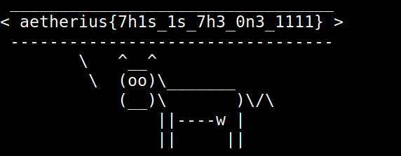

Opened the packet capture on Wireshark.
Noticed a file transferred which looked like a `PNG`.

After downloading it when i tried to open it it was giving an error. 

Assuming it was corrupted I opened it in my hex editor and fixed the corrupted bytes.
Opening the fixed image gave the flag.

# Flag
