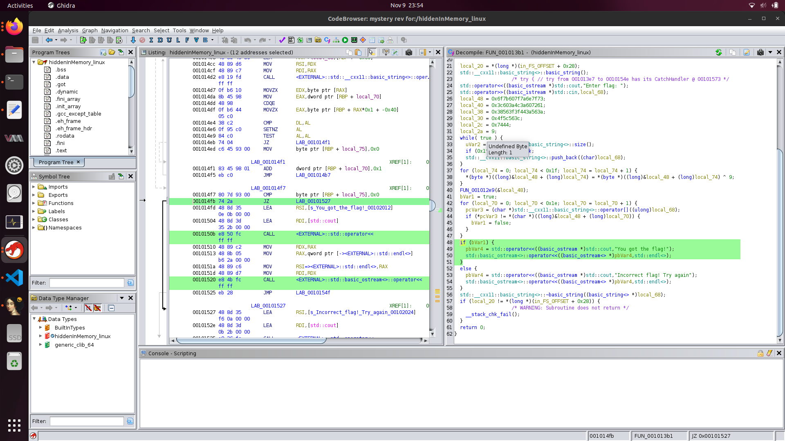

# Solution

This challenge deals with a variable that is hidden in the memory of a program (as the name suggests).

First i opened the file in ghidra to decompile it and see what's happening inside.


Here we see that the program checks the string against some combination of variables.
So to check the value of the variable I decided to run it in IDA's debugger (I dont know how to use ghidra's). I placed a breakpoint on the conditional that branches into the outputs and ran it. Once paused, I opened the varible that is checked against in hex view and found the flag right next to it.


## Flag
```aetherius{r3V3r53_3N66_15_FUN}```